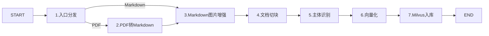
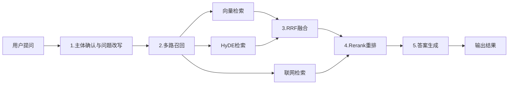

# 船舶海事法律智能问答系统项目(RAG)实战

## 2. 模块流程设计

### 2.1 导入核心业务流程

#### 2.1.1 设计目标

导入模块的目标，是把原始的 PDF、Markdown 文档加工成后续 RAG 查询可直接使用的高质量知识单元。

这里面要解决的，不只是“把文件读出来”这么简单，而是要解决下面几类问题：

1. **复杂文档解析问题**
   - PDF 天然不适合直接做检索，排版、标题、表格、图片关系容易丢失。
   - 所以需要先把 PDF 转成结构更清晰的 Markdown。
2. **图文信息不完整问题**
   - 很多产品手册里的关键知识在图片、示意图、界面截图里。
   - 如果只保留纯文本，后面的检索上下文会天然残缺。
3. **长文档无法直接入库问题**
   - 原始文档太长，不能直接整篇交给大模型检索。
   - 所以需要先切分成多个语义完整的小片段。
4. **切片主体缺失问题**
   - 很多 chunk 脱离全文后，已经无法看出是在描述哪个产品或设备。
   - 所以需要补齐主体名称，增强后续检索精度。

从系统设计角度看，导入链的职责并不是单纯做“数据搬运”，而是完成一次从**原始文档**到**检索友好型知识单元**的结构化加工。  也就是说，导入链最终产出的数据，需要同时满足下面几个要求：

- **结构清晰**
  - 文档层级、标题关系、正文内容尽可能保留下来，避免后续检索命中后无法定位上下文。
- **语义完整**
  - 图片、主体名称、标题路径等信息要补充到文本中，减少切片脱离全文后语义残缺的问题。
- **检索友好**
  - 数据不能只保留“原文内容”，还要具备可向量化、可过滤、可排序的字段设计。
- **可持久化**
  - 最终结果要能够稳定写入 Milvus，并作为查询链的标准输入。

导入流程最终的目标，是将文档加工成：

- 有结构的文本内容
- 有主体标识的切片数据
- 有 dense / sparse 向量表示
- 可直接写入 Milvus 的知识单元

#### 2.1.2 处理链路详解

当前项目的导入链，采用 **LangGraph** 进行流程编排，整体步骤如下：

下面按步骤看每个节点负责什么。

1. **Step 1：入口分发（node_entry）**
   - 作为整个导入图的入口节点。
   - 根据文件后缀判断当前输入是 PDF 还是 Markdown。
   - 如果是 PDF，则进入 `node_pdf_to_md`。
   - 如果是 Markdown，则跳过 PDF 解析，直接进入 `node_md_img`。

2. **Step 2：PDF 转 Markdown（node_pdf_to_md）**
   - 负责调用 PDF 解析能力，将 PDF 转成结构化 Markdown。
   - 这里会保留标题、章节、图片引用等关键信息。
   - 这一层的目标，是把“难处理的 PDF”转成“后续节点容易继续加工的文本结构”。

3. **Step 3：Markdown 图片增强（node_md_img）**
   - 负责扫描 Markdown 中的图片内容。
   - 对图片做上传、识别或补充描述，把原来只能看图理解的信息补成文本信息。
   - 这样后面在切块、检索时，图片知识也能参与语义召回。

4. **Step 4：文档切块（node_document_split）**
   - 将完整 Markdown 文档切分成多个 chunk。
   - 目标不是机械切分，而是尽量保留语义完整性。
   - 这样后续查询时，命中的不是整篇文档，而是更精准的证据片段。

5. **Step 5：主体识别（node_item_name_recognition）**
   - 基于文档内容识别当前文档对应的主体对象。
   - 例如某本手册对应的是某个型号、某个产品、某个设备。
   - 后续会将主体信息补充到切片里，避免切片脱离全文后语义不完整。

6. **Step 6：向量化（node_bge_embedding）**
   - 对处理后的 chunk 做向量编码。
   - 当前项目使用 BGE-M3，能够同时生成 dense vector 和 sparse vector。
   - 这一步是后续 Milvus 混合检索的基础。

7. **Step 7：Milvus 入库（node_import_milvus）**
   - 将最终整理好的切片数据写入 Milvus。
   - 这一步完成后，知识库才真正具备后续查询能力。

这条链路的设计思路，本质上是一个典型的“逐步增值加工”过程：

1. 先把原始文件转换成结构化文本
2. 再把图片、标题、主体等上下文补全进去
3. 再将文档拆成适合检索的小单元
4. 最后将这些小单元转换成向量并写入向量库

也就是说，导入链的每一步都不是孤立存在的，而是在为下一步创造更高质量的输入条件。

#### 2.1.3 核心技术栈

- **LangGraph**
  - 用于编排整条导入流程，把每个节点组织成一条稳定的处理主链。
- **MinerU / PDF 解析能力**
  - 用于将 PDF 结构化转换为 Markdown。
- **多模态模型**
  - 用于理解图片内容，补充图像语义。
- **BGE-M3**
  - 用于生成 dense / sparse 向量。
- **LangChain Text Splitters**
  - 用于在标题级粗切之后继续做递归细切，控制 chunk 长度与重叠范围。
- **Milvus**
  - 用于承载最终向量化后的知识单元。
- **MinIO**
  - 用于处理图片上传与对象存储场景。

#### 2.1.4 向量数据库设计和说明

为平衡导入性能、检索精度并支撑业务拓展，本项目采用**双层索引架构**，按数据职责拆分存储，实现分层检索。

1. **文档级索引**

   存储文档整体主体、归属信息与文档级向量，用于检索前置的主体判定、检索范围过滤。

2. **切片级索引**

   存储拆分后的文本切片、标题层级、切片向量等核心检索数据，是 RAG 召回、精排、答案生成的主要数据源。

架构核心为**数据分层、职责分离**：文档级索引聚焦文档整体属性，切片级索引聚焦细粒度内容语义。二者拆分可避免字段混杂、逻辑模糊，遵循「先圈定目标文档范围，再精准匹配文档内片段」的检索逻辑，兼顾管理效率与检索效果。

**文档级索引（kb_item_names）**

核心定位：作为主体名称索引表，用于记录主体名称及其向量表示。在当前项目的数据口径下，一篇文档通常只围绕一个主体展开，因此教学上可以把它理解为“文档主体层索引”。

| 字段名 | 字段类型 | 核心作用 |
| :--- | :--- | :--- |
| pk | Int64（自增主键） | 文档级唯一标识 |
| file_title | VarChar(512) | 原始文件标题，用于溯源 |
| item_name | VarChar(512) | 文档主体名称 |
| dense_vector | FloatVector(1024) | 主体名称的语义向量 |
| sparse_vector | SparseFloatVector | 主体名称的关键词向量 |

文档级索引在业务检索链路中起到关键前置过滤作用。实际场景中，用户提问大多指向特定产品、设备型号等业务主体，例如：*HAK180 的报警灯什么意思？*、*这款设备怎么调节顶部区域？* 这类问句，需先完成**主体匹配**，再执行细粒度切片检索。

结合业务特性，本项目采用**单文档绑定单一主体名称**的设计：因导入资料多为单品、单型号专属文档，整份文档内容围绕同一业务主体展开。基于此，在文档层级统一识别主体标识 `item_name`，并同步关联至该文档下所有文本切片。

该设计具备两点优势：一是在文档维度完成主体判定，降低整体识别开销；二是为所有切片补全主体信息，解决片段脱离原文后语义缺失的问题。检索阶段遵循**先通过文档索引圈定主体范围，再基于切片索引精准召回内容**的分层逻辑，提升检索效率与准确性。

**切片级索引（kb_chunks）**

核心定位：作为真正参与检索的核心知识表，存储每个 chunk 的文本、标题、主体和向量信息。

| 字段名 | 字段类型 | 核心作用 |
| :--- | :--- | :--- |
| chunk_id | Int64（自增主键） | 切片全局唯一标识 |
| content | VarChar(65535) | 切片内容 |
| title | VarChar(512) | 所属标题路径 |
| parent_title | VarChar(512) | 父级标题 |
| part | Int8 | 分片顺序标记 |
| file_title | VarChar(512) | 所属原始文件标题 |
| item_name | VarChar(512) | 所属主体名称 |
| sparse_vector | SparseFloatVector | 切片关键词向量 |
| dense_vector | FloatVector(1024) | 切片语义向量 |

切片级索引是 RAG 系统的核心数据层，大模型生成答案所依赖的上下文，均来源于该层级召回的文本切片。因此设计时除基础存储能力外，需重点兼顾检索效果、语义完整性与数据可用性，主要围绕三大维度考量：

1. **合理把控检索粒度**

   切片长度直接影响答案质量：切片过长会导致内容冗余、定位不准，降低回答精度；切片过短则易缺失关联信息，造成语义断层。

2. **完善语义补充字段**

   除核心文本`content`外，配套存储`title`、`parent_title`、`item_name`等字段，补全层级关系与主体信息，避免切片脱离原文后语义残缺。

3. **适配检索过滤与结果展示**

   依托`file_title`、`item_name`等结构化字段，可高效实现数据筛选、分组归类，同时支撑检索结果溯源与前端展示。

综上，`kb_chunks`中存储的并非原始文本，而是经过结构化加工、语义增强，可支撑全链路检索、排序与生成环节的标准化知识片段。

### 2.2 检索核心业务流程

#### 2.2.1 设计目标

查询模块的目标，不是简单地把用户问题“丢给模型回答”，而是通过一条可控、可解释、可扩展的检索增强链路，将自然语言问题逐步转化为高质量答案。

在真实业务系统中，查询阶段通常面临的并不是“模型能力不够强”这一个问题，更关键的是：**模型是否拿到了足够正确、足够完整、足够相关的上下文证据**。  因此，当前查询链的核心设计目标，可以概括为以下四点：

1. **准确理解用户问题**
   - 用户问题往往具有口语化、省略主体、上下文依赖强等特点。
   - 如果在检索之前没有先完成主体确认与问题改写，后续召回往往会偏离真正意图。

2. **尽可能提高召回覆盖率**
   - 单一路径检索虽然实现简单，但很难同时兼顾语义相似、隐式意图、专业术语匹配以及外部补充信息。
   - 因此需要通过多路召回，从不同角度把潜在相关信息尽量找回来。

3. **控制召回结果的噪声水平**
   - 召回覆盖率提高之后，候选结果中一定会混入部分弱相关甚至无关内容。
   - 如果不再做融合与重排，大模型接收到的上下文就会变得嘈杂，最终答案稳定性会明显下降。

4. **为答案生成提供高质量上下文**
   - 生成阶段最重要的不是“模型回答得多快”，而是“模型回答时依据的上下文是否足够干净、充分、可信”。
   - 因此，查询链必须先完成问题理解、候选召回、结果融合和精排序，再进入最终答案生成阶段。

从工程实现角度看，当前查询链本质上是在解决两个核心问题：

- **如何尽可能不漏掉真正相关的信息**
- **如何尽可能不把无关信息交给大模型**

前者依赖多路召回，后者依赖融合与重排。  只有这两部分同时做好，模型生成阶段才有稳定输出高质量答案的基础。

#### 2.2.2 处理链路详解

查询链路通过**多阶段可控、分层递进**的检索增强逻辑，将用户自然语言问题，逐步加工、筛选、提纯为高质量上下文，最终交由大模型生成精准答案。整体遵循**先理解意图 → 多路找全候选 → 分层融合精排 → 高质量生成**的工程设计思路。

**Step 1：主体确认 & 问题改写**

结合用户当前提问与历史对话，**精准识别、补全业务主体**，解决用户提问省略主体、指代模糊、口语化问题。

同时对原始问句进行检索优化改写，生成更适配向量检索、语义匹配的标准查询，为后续精准召回奠定基础。

**Step 2：多路召回（核心信息补齐层）**

系统采用**三路差异化并行召回**，通过不同检索机制互补，最大化提升信息覆盖率，避免单一路径召回局限。三路职责严格拆分、各司其职：

**1）向量检索（基础主召回）**

作为本地知识库**核心稳定召回通道**，基于改写后的问题与主体信息，从 Milvus 切片索引中召回语义相似内容。

擅长解决**语义表达不一致、措辞不同但含义相同**的匹配场景，承担本地知识的基础兜底召回能力。

**2）HyDE 检索（弱意图增强召回）**

不直接使用原问题检索，而是由大模型**生成假设性答案**作为检索输入。

专门优化**问句过短、语义稀疏、表达抽象、意图弱**的场景，通过强化查询语义表达，弥补原生问句信息量不足导致的漏召问题，增强本地召回完备性。

**3）联网检索（边界补全召回）**

通过联网能力获取外部公开资料、最新参数、官网信息。

不替代本地知识库，仅作为**知识边界补充**，解决本地文档未覆盖、内容滞后、资料不全的场景，补齐私有知识库局限性。

三路协同逻辑:

- 向量检索：**保基础、稳兜底**
- HyDE 检索：**补弱意图、防漏召**
- 联网检索：**扩边界、补缺失**

> 分层策略：**两路本地召回先融合，外网结果独立保留，最终统一重排**

**Step 3：RRF 本地结果融合**

RRF 仅针对**两路本地向量召回结果**（向量检索 + HyDE 检索）做排名融合。

通过 reciprocal rank 排名加权机制，对同时在两路召回中排名靠前的切片进行权重增强，合并去重、择优打分。

**解决本地双路结果排序不一致、候选分散问题，输出更稳定、更精准的本地最优候选集合。**

**Step 4：Rerank 全局精排**

将 **RRF 本地融合结果 + 外网搜索结果** 统一数据结构，纳入同一语义评分体系。

通过重排模型逐一对「问题 - 文档」做细粒度相关性打分，结合**动态分数断崖截断**筛选优质上下文。

**核心价值：统一本地 / 外网数据源评判标准，过滤噪声、修正排序偏差，最终输出可直接用于生成的高纯净上下文。**

**Step 5：答案生成输出**

基于精排筛选后的高质量、高相关、低噪声参考片段，结合对话历史、业务主体信息组装 Prompt。

大模型仅负责**内容组织与语言生成**，不再承担资料检索与判断工作，大幅降低幻觉、提升回答准确性与稳定性。

同时支持流式增量输出、图片资源提取、对话历史落库，完成全链路最终结果交付。

从工程实现角度看，当前查询链在召回与排序上的职责边界可以概括为：

- 普通向量检索 + HyDE 检索：负责本地知识库候选召回
- `RRF`：负责整合本地两路向量召回结果
- `MCP` 联网搜索：负责补充外部候选信息
- `Rerank`：负责把本地候选与外部候选统一排序

也正因为如此，这一层追求的不是“一次就筛到很干净”，而是先把候选找全、再逐层收敛。

这条查询链的整体思路，可以概括成三句话：

1. **先理解问题，再启动检索**
2. **先尽可能召回，再统一做筛选**
3. **先准备高质量上下文，再交给模型生成**

这也是为什么当前项目把查询链拆成多阶段，而不是直接“问题进来 -> 查一次库 -> 模型回答”。

#### 2.2.3 核心技术栈

- **LangGraph**
  - 用于编排主体确认、多路召回、融合、重排和答案生成。
- **Milvus**
  - 用于承载向量检索。
- **BGE-M3**
  - 用于查询向量编码以及与导入链统一向量空间。
- **HyDE**
  - 用于生成假设性回答，增强召回效果。
- **RRF**
  - 用于融合普通向量检索与 HyDE 检索两路本地召回结果。
- **Reranker**
  - 用于对 `RRF` 本地结果与 `MCP` 联网结果做统一精排。
- **LLM**
  - 用于问题改写、主体确认和最终答案生成。
- **MCP / WebSearch**
  - 用于做联网搜索补充召回。
- **MongoDB / 历史记录持久化**
  - 用于保存多轮对话消息，并在主体确认与答案生成阶段回补历史上下文。
- **SSE**
  - 用于在流式问答场景下把模型增量输出实时推送给前端。

#### 2.2.4 查询链设计总结

查询链的设计重点，不在于“把问题直接送进模型”，而在于先把检索上下文做好。

可以概括为下面这条主线：

1. 先理解用户问题
2. 再多路召回相关信息
3. 再统一融合和重排
4. 最后把高质量上下文交给模型生成答案

这套设计的核心价值在于：

- 主体更准确
- 召回更全面
- 噪声更少
- 最终答案更稳定

如果从 RAG 工程实现角度总结，这条查询链其实是在解决两个核心问题：

1. **如何尽可能不漏掉真正相关的信息**
2. **如何尽可能不把无关信息交给大模型**

前者依赖多路召回，后者依赖融合与重排。  而这两件事做好之后，大模型才真正有机会基于高质量上下文输出稳定答案。

进一步拆开来看，当前查询链其实对应三层逐步收敛的处理逻辑：

1. **多路召回解决覆盖率问题**
   - 目标是尽量不漏掉可能相关的内容。
   - 这一层强调“找全”，不强调一次性筛得很干净。

2. **RRF 融合解决本地两路向量召回整合问题**
   - 目标是把普通向量检索和 HyDE 检索先整合成一组更稳定的本地候选集合。
   - 这一层强调的是本地语义召回结果的内部融合，而不是对所有来源一次性总融合。

3. **Rerank 解决统一排序与纯度问题**
   - 目标是把本地候选结果和联网候选结果拉到统一排序标准下，再筛出最相关内容。
   - 这一层强调“统一比较 + 最终筛选”，尽量减少无关信息进入生成阶段。

因此，查询链之所以设计成现在这样，并不是为了让流程显得复杂，而是为了同时兼顾：

- **召回覆盖率**
- **结果相关性**
- **答案稳定性**

这也是企业级 RAG 系统与“简单向量检索 + 大模型生成”方案之间最核心的差异之一。

